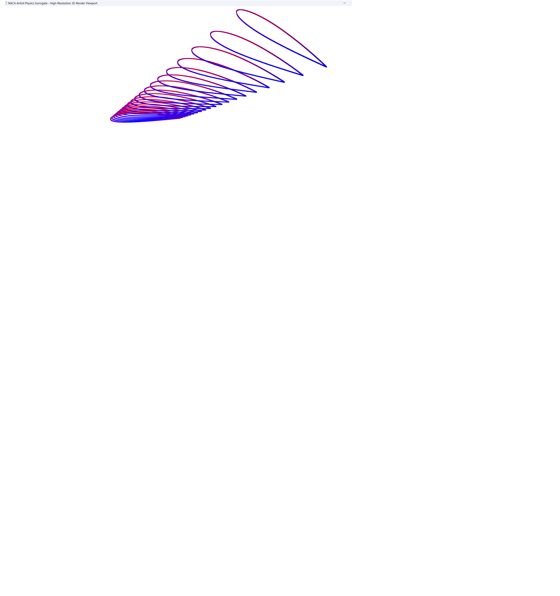
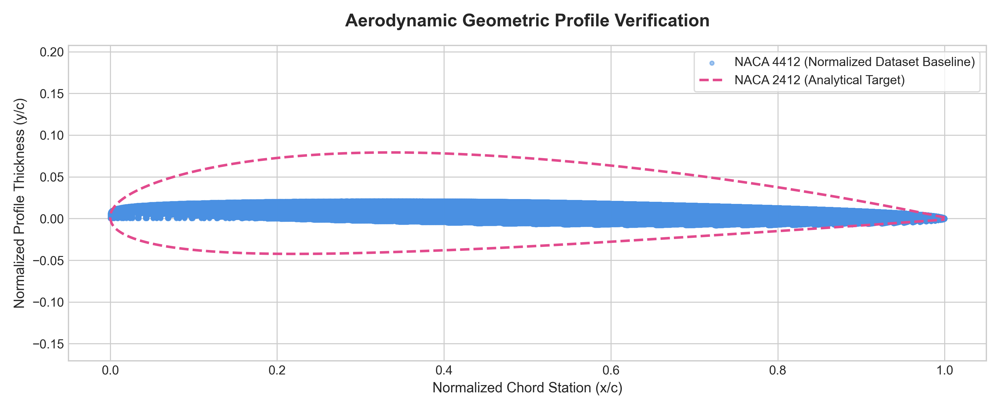

# Parametric 4-Digit NACA Airfoil Computational Geometry Framework 

A high-fidelity computational geometry pipeline engineered to parse data-driven spatial profiles, execute numerical exploratory analytics, and generate parametric mathematical reference maps using 4-digit NACA distribution functions. This framework provides cross-profile alignment checks across 2D and 3D coordinate domains for downstream engineering utilization.

---

##  Visual Engineering Analytics

### 1. High-Resolution 3D Geometric Mesh Viewport
Below is the generation output from the linear mesh projection engine, showcasing a structured 3D wing profile configured with a **0.6 taper ratio** and a **-5.0° aerodynamic washout (twist)** around the leading edge.

<p align="center">
  
</p>

### 2. Data-Driven vs. Analytical Profile Verification (2D)
The framework automatically maps empirical data-driven coordinates against theoretical parametric thickness distributions to audit camber line deviations, correcting coordinate scale distortions dynamically.

<p align="center">
  
</p>

---

##  System Architecture & Layout

```text
├── data/
│   ├── raw/                   <- Primary target datasets (e.g., 4412.csv)
│   └── processed/             <- Dynamically generated assets & visualizations
├── src/
│   ├── config.py              <- Application parameter configurations
│   ├── geometry_engine.py     <- Core mathematical and extrusion functions
│   ├── visualization.py       <- Automation plotting engine
│   ├── view_3d_mesh.py        <- Interactive 3D point cloud GUI viewer
│   └── run_pipeline.py        <- Core processing runner engine
├── notebooks/
│   └── aerodynamic_exploration.ipynb <- Historical exploratory R&D workspace
└── tests/
    └── test_geometry.py       <- Automated mathematical boundary test maps